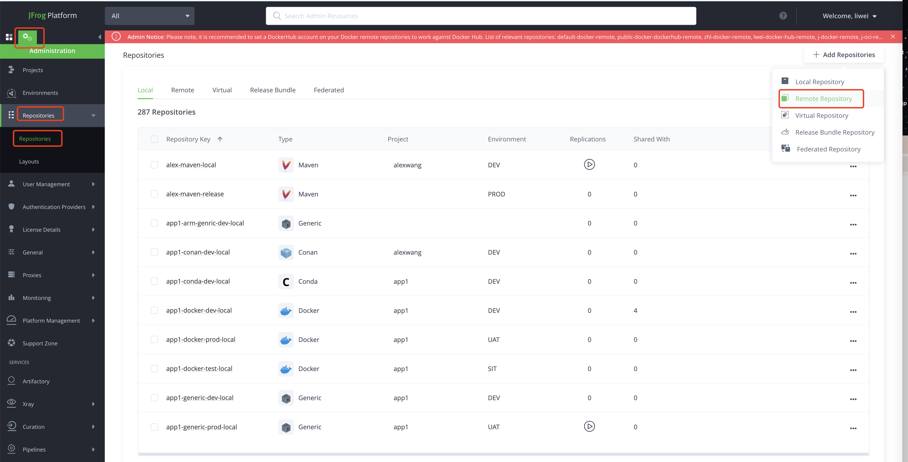
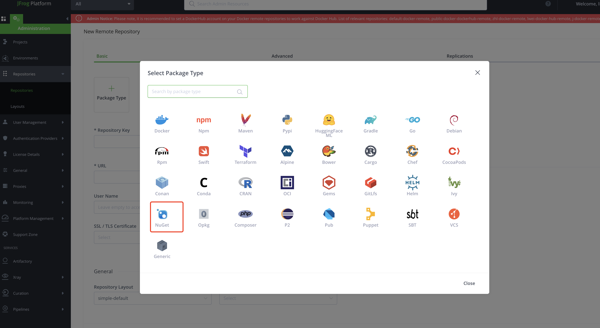
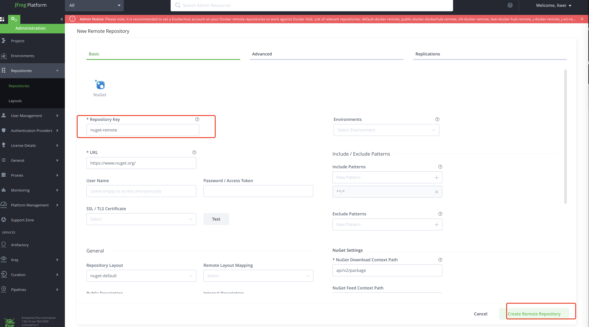
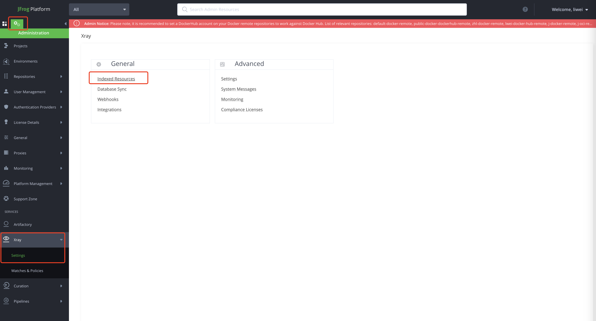
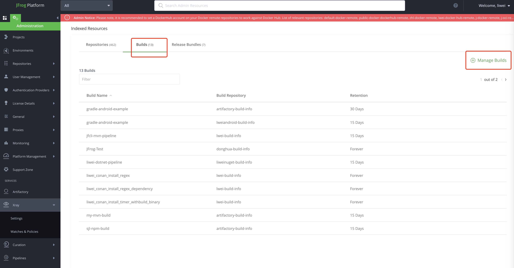
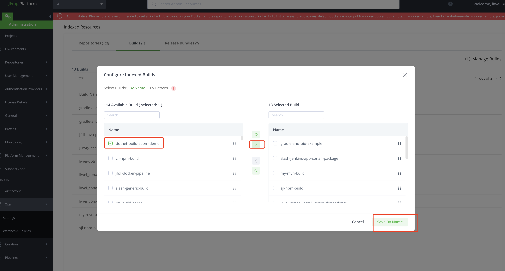
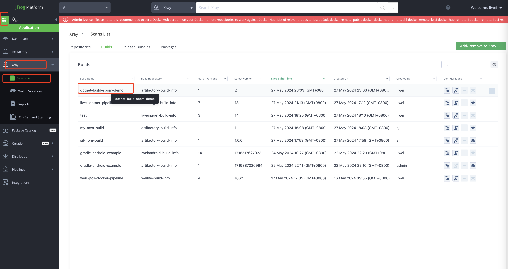
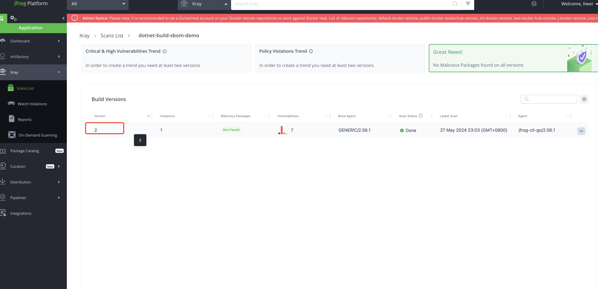
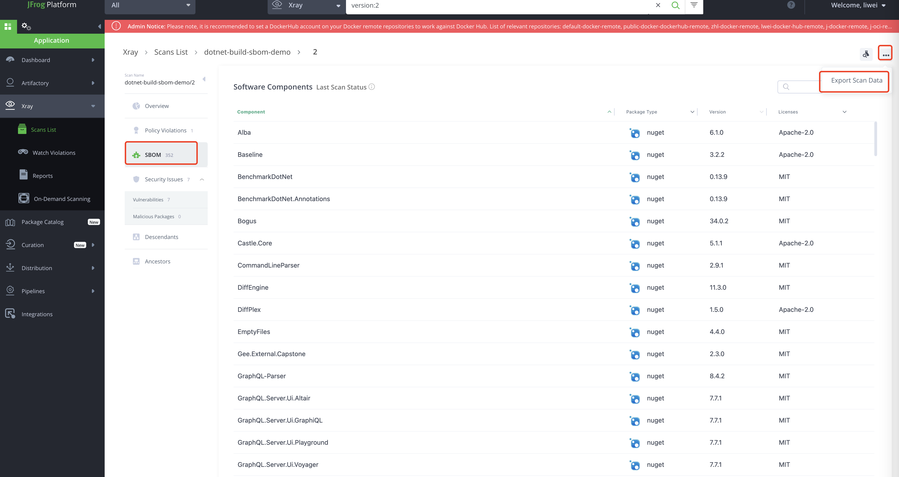
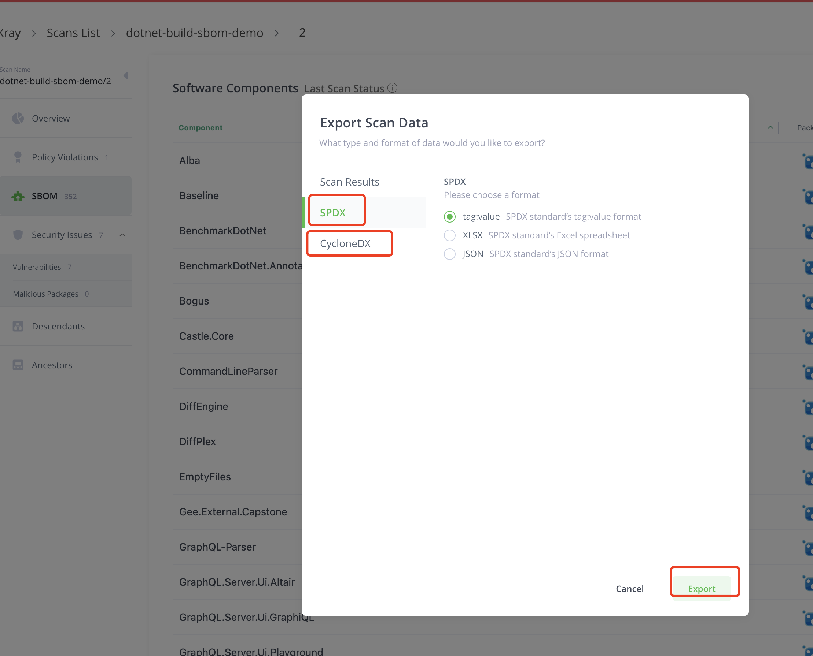

## This is a C# demo project. This project downloads nuget dependency packages from Artifactory Server through the "jf command line", uploads the build dependences information to JFrog, using JFrog Xray scans the dependency packages , and obtains the SBOM report.


# 1，Create nuget remote repo in JFrog Server





#### JFrog Repo Create Docs:[Create Nuget Remote Repo](https://jfrog.com/help/r/jfrog-artifactory-documentation/set-up-remote-nuget-repositories).


# 2，Install the JFrog CLI tool in a system with .Net environment

## (1),Demo environment uses centos7 operating system, install .net 7.0SDK
```
sudo rpm -Uvh https://packages.microsoft.com/config/centos/7/packages-microsoft-prod.rpm
sudo yum update
sudo yum install -y dotnet-sdk-7.0
```

## (2),Install JFrog CLI
```
echo "\[jfrog-cli\]" > jfrog-cli.repo;
echo "name=jfrog-cli" >> jfrog-cli.repo;
echo "baseurl=https://releases.jfrog.io/artifactory/jfrog-rpms" >> jfrog-cli.repo;
echo "enabled=1" >> jfrog-cli.repo;
rpm --import https://releases.jfrog.io/artifactory/jfrog-gpg-public/jfrog\_public\_gpg.key
sudo mv jfrog-cli.repo /etc/yum.repos.d/;
yum install -y jfrog-cli-v2-jf;
```
#### JFrog CLI Installation Docs:[JFrog CLI installation](https://docs.jfrog-applications.jfrog.io/jfrog-applications/jfrog-cli/install).

# 3，Set up JFrog CLI to connect to JFrog Server
```
jf c add
#Enter a unique server identifier:jfrogname
#JFrog Platform UR:https://jfrog.url.com
#Username and Password :
#Is the Artifactory reverse proxy configured to accept a client certificate? (y/n) [n]?n
```
#### JFrog CLI Setup Docs:[JFrog CLI Setup](https://docs.jfrog-applications.jfrog.io/jfrog-applications/jfrog-cli/cli-for-jfrog-artifactory/authentication).

# 4，Set up JFrog CLI .net global environment
```
jf dotnetc --global
#Resolve dependencies from Artifactory? (y/n) [y]? :y
#Set Artifactory server ID [jfrogchina]: jfrogname
#Set repository for dependencies resolution :nuget-remote
#Use NuGet V2 Protocol? (y/n) [n]? :n
```
#### JFrog CLI Nuget build Docs:[JFrog CLI Nuget Env setup](https://docs.jfrog-applications.jfrog.io/jfrog-applications/jfrog-cli/cli-for-jfrog-artifactory/package-managers-integration#building-nuget-packages)).

# 5，Clone .net project source code

```
#Create a working directory and clone the code
mkdir  ~/dotnet_work
cd ~/dotnet_work
git clone https://github.com/JFrogChina/dotnet-build-sbom-demo.git
```

# 6，Build .net project with JFrog CLI

```
 cd dotnet-build-sbom-demo
 jf dotnet restore ./src/GraphQL.sln --build-name=dotnet-build-sbom-demo --build-number=1
```
#### JFrog CLI Nuget build Docs:[JFrog CLI Nuget restore dependencies](https://docs.jfrog-applications.jfrog.io/jfrog-applications/jfrog-cli/cli-for-jfrog-artifactory/package-managers-integration#running-nuget-and-dotnet-commands).
 
# 7，Upload build info to JFrog Server
```
 jf rt bp dotnet-build-sbom-demo 1
```
#### JFrog CLI Nuget build Docs:[JFrog CLI Nuget publish Build-Info](https://docs.jfrog-applications.jfrog.io/jfrog-applications/jfrog-cli/cli-for-jfrog-artifactory/build-integration#publishing-build-info)


# 8，Setup JFrog Xray index

## （1），Turn on Xray index for  build info 





## （2），Run build again
```
cd ~/dotnet_work
cd dotnet-build-sbom-demo/
jf dotnet restore ./src/GraphQL.sln --build-name=dotnet-build-sbom-demo --build-number=2
jf rt bp dotnet-build-sbom-demo 2
```

# 9，Export SBOM report in JFrog Website





